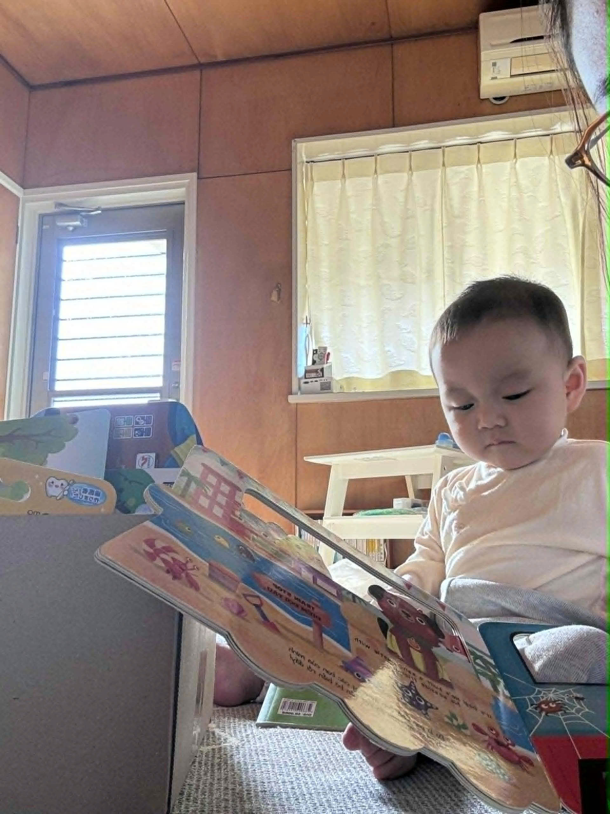

<!DOCTYPE html>
<html>
<head>
  <title>IT 勉強用サイト</title>

  
</head>

<body>
  

    <h1>Nguyễn Tất Trung</h1>
    
Đây là website đầu tiên của tôi

    
Tôi sẽ học IT để làm màu với vợ tôi 😎

    

    <button onclick="hello()">Bấm vào đây</button>
  

  
</body>
</html>
